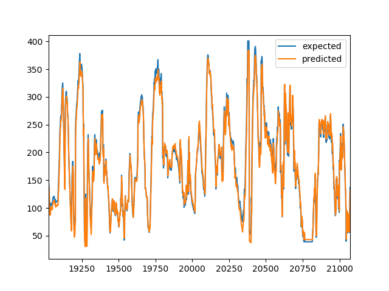

# Long/Short Term Memory (LSTM)

## Team Members:

* Amir Mohammad Fallah (970122680014)

## Description:
This project is about predicting patients blood glucose level using a Long-Short Term Memory network approach. 
The dataset which is stored as data.csv in dataset directory consists of blood glucose time series records of 203 type 2 diabetes patients which is gathered in 5 minutes interval.
The goal is to predict the upcoming blood sugar changing events according to the pattern of the patients records.

### Requirements
* Python 3
* NumPy (using array functions)
* Matplotlib (showing graphs)
* Scikit-learn (preprocessing data)
* Tensorflow 
* Keras
* Pandas (reading CSV dataset files)
* IPython notebook reader

### Running
Open lstm.ipynb In Jupyter Notebook and follow the instructions.

### Output and evaluation
The trained model and weights are exported as [network, 13.60927438180099.h5](https://github.com/alitourani/computational-intelligence-class-9901/blob/master/G06-Long-Short-Term-Memory/network%2C%2013.60927438180099.h5)  file.
The model was evaluated with RMSE metric and the score was 13.6092.
The following graph will demonstrate the performance of the model in predicting the test set.

